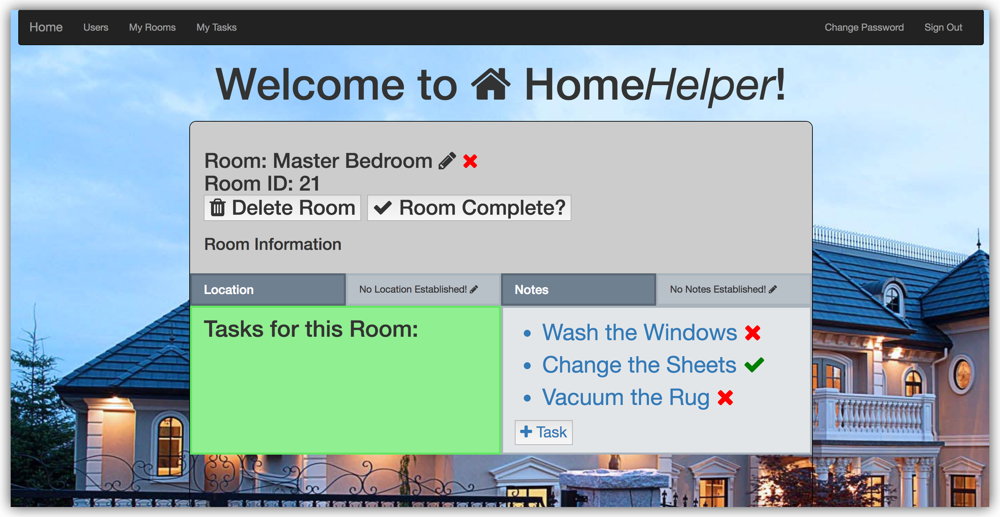
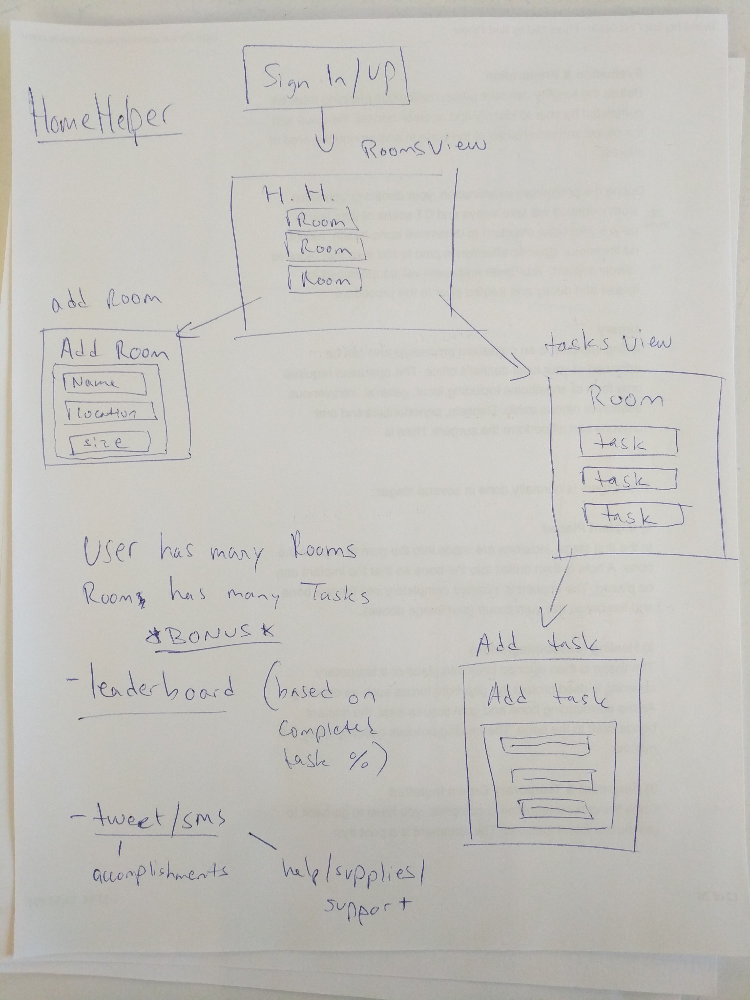

# Home*Helper* Client ReadME

Version: 1.0

### Technologies Used:
Ember.JS, JavaScript, AJAX, HTMLbars, HTML5, CSS3 + Sass

### Project Links
**Client (Front End) -**
[Deployed Client](https://wbounas.github.io/homehelper-client)
| [GitHub Client Repo](https://github.com/wbounas/homehelper-client)

**API (Back End) -**
[Deployed API](https://homehelper-api.herokuapp.com)
| [GitHub API Repo](https://github.com/wbounas/homehelper-client)

### About
Home*Helper* is a web application that helps users organize the tasks they need to complete in order to have the home they truly deserve! The basis of the idea came from both my growth as a web developer, and also my personal need for organizing my home. While at first the task seems insurmountable, it starts to become more achievable as you break down the ultimate goal into smaller, more reachable goals that you can accomplish one by one.

### Dev Notes *(version 1.0)*
This was my first web app built using a front-end framework. At GA-WDI in Boston, we were taught Ember.JS for our last unit of the course, and I decided it would be a great challenge for myself to A. use Ember and B. to build an API with 2 resources, as I was unable to achieve this during our 2nd project week, where we were focusing on building a Ruby on Rails API along with a front-end client built with JS, HTML, and CSS.

This was a great learning experience for me, but ultimately the app at this stage is not where I want it to be. The UX is something that will need to be improved dramatically in order to achieve the vision for that app that I have. However, I think it is very achievable in a short amount of time! Also, getting familiar with the concept of a front-end framework proved to be very valuable, and although I do still have a long way to go, I have made some important first steps in the journey.

### Future Iterations
- Add tasks to a room from the room view
- Break down current components into smaller, more re-usable components
- Create uniform styling across the app for consistency and overall better UX
- Provide a leaderboard that shows who has accomplished the most tasks on the app
- Provide a 'tweet' feature for tasks that have been accomplished
- Provide an 'SMS' feature for tasks that are not completed, but the user may need assistance with
- Add search functionality for user's tasks and rooms

## User Stories
### Version 1
**EPIC:** As a user, I want to add tasks that I need to accomplish to have a cleaner living space.
User Stories:
- As a user, I want to be able to sign-up, sign-in, change my password, and sign-out of the application
- As a user, I want to be able to add tasks I need to accomplish around the house
- As a user, I want to be able to delete tasks that no longer need to be completed, or are erroneous
- As a user, I want to be able to edit tasks that I have already created, if they've changed or need updating
- As a user, I want to be able to see all of the tasks that I have saved that need to get done

### Version 2
**EPIC:** As a user, I want to organize my tasks into the rooms that they take place in
User Stories:
- As a user, I want to keep track of all the rooms in my home that will have tasks I need to accomplish
- As a user, I want to be able to add, delete, or modify any of these rooms that I have in my account
- As a user, I want to have both my rooms and tasks color-coded based on their state of accomplishment
- As a user, I want to have my tasks ranked (sorted) based on priority

#### Bonuses:
- Public Leaderboard: All users can see other users' total % of tasks accomplished
- Twitter Integration: Users can tweet out on successful accomplishment of a task
- SMS Integration: Users can send a text for support if needed for a particular task
- Seeding Values: Give users common tasks, est. times, priorities, to choose
  from (in addition to creating their own)

#### [Planning Materials](planning)

## Wireframes

